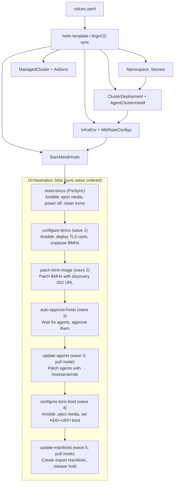
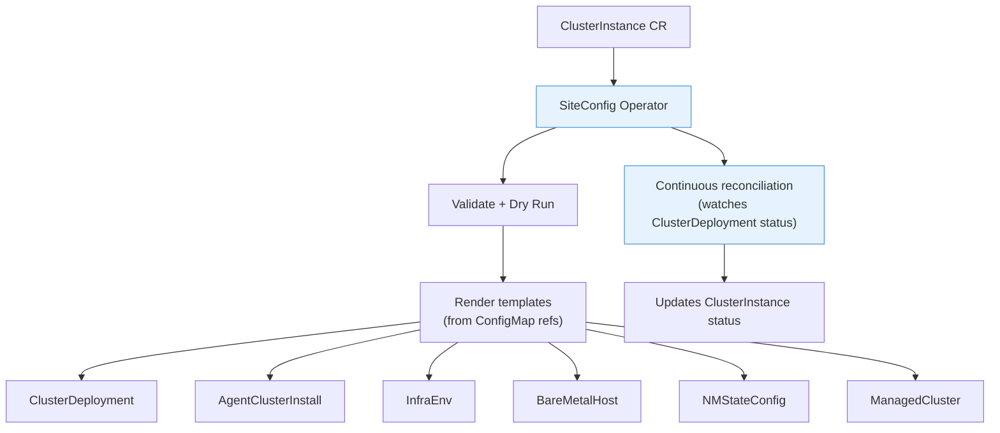
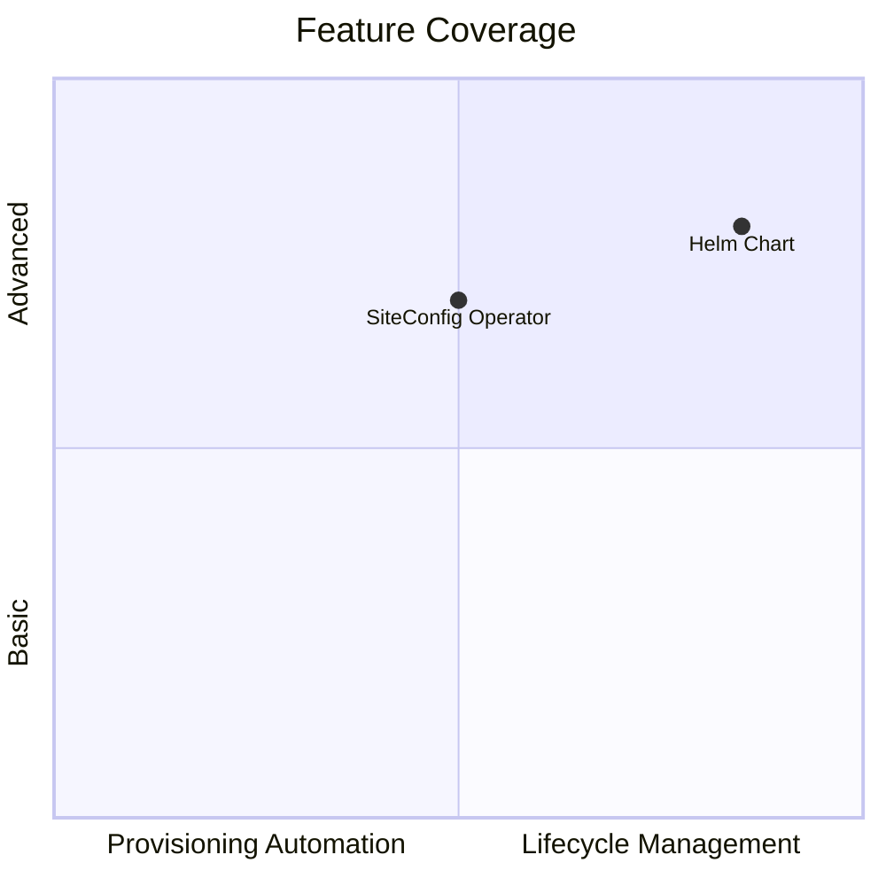

# Helm Chart vs. SiteConfig Operator: A Comparison

This document compares the `cluster-install` Helm chart in this repository with Red Hat's [SiteConfig operator](https://docs.redhat.com/en/documentation/red_hat_advanced_cluster_management_for_kubernetes/2.14/html/multicluster_engine_operator_with_red_hat_advanced_cluster_management/siteconfig-intro) and its `ClusterInstance` custom resource for deploying bare-metal OpenShift clusters via ACM.

---

## Overview

Both approaches deploy OpenShift clusters on bare metal using the Assisted Installer via ACM. They target the same underlying resources (ClusterDeployment, AgentClusterInstall, InfraEnv, BareMetalHost, NMStateConfig, etc.) but differ in how those resources are authored, orchestrated, and managed post-deploy.

| | Helm Chart | SiteConfig Operator |
|---|---|---|
| **API** | Helm values.yaml | `ClusterInstance` CR (siteconfig.open-cluster-management.io/v1alpha1) |
| **Templating** | Go templates (Helm) | Go `text/template` (ConfigMap-based) |
| **Lifecycle** | One-shot render + Jobs | Operator reconciliation loop |
| **Minimum ACM version** | Any (uses standard CRDs) | ACM 2.12+ / MCE 2.7+ |
| **GitOps** | ArgoCD Application (Helm source) | ArgoCD Application or direct `oc apply` |

## Architecture

### Helm Chart Flow

### SiteConfig Operator Flow

---

## Feature Comparison

### Core Cluster Resources

| Feature | Helm Chart | SiteConfig Operator | Notes |
|---|:---:|:---:|---|
| ClusterDeployment | Yes | Yes | |
| AgentClusterInstall | Yes | Yes | Via templates |
| InfraEnv | Yes | Yes | Via templates |
| BareMetalHost | Yes | Yes | Via templates |
| NMStateConfig | Yes | Yes | Via templates |
| ManagedCluster | Yes (pull mode) | Yes | Chart creates it only in pull mode; SiteConfig always creates it |
| ManagedClusterAddOns | Yes | No | Chart deploys governance-policy-framework + config-policy-controller |
| ManagedClusterSet | Yes | No | Chart auto-creates if missing, with `keep` policy |
| ManagedClusterSetBinding | Yes | No | Chart binds namespace to cluster set |
| ClusterCurator (AAP) | Yes | No | Chart integrates with AAP for prehook automation |

### installConfigOverrides

| Feature | Helm Chart | SiteConfig Operator |
|---|:---:|:---:|
| cpuPartitioningMode | Yes (structured) | Yes (JSON string) |
| capabilities.baselineCapabilitySet | Yes (structured) | Yes (JSON string) |
| capabilities.additionalEnabledCapabilities | Yes (structured) | Yes (JSON string) |
| networkType | Via AgentClusterInstall | Yes |

The chart uses structured values that are rendered into the `agent-install.openshift.io/install-config-overrides` annotation on AgentClusterInstall. SiteConfig exposes this as a special template variable (`installConfigOverrides`) that merges networkType, cpuPartitioningMode, and the overrides JSON into a single field.

**Chart advantage**: Structured YAML input with Helm validation is less error-prone than hand-crafting a JSON string.

### BMC Configuration

| Feature | Helm Chart | SiteConfig Operator |
|---|:---:|:---:|
| BMC address (Redfish) | Yes | Yes |
| BMC credentials (Secret) | Yes (auto-generated) | Yes (manual Secret) |
| disableCertificateVerification | Yes (configurable) | Yes |
| automatedCleaningMode | Yes (default: disabled) | Yes |
| rootDeviceHints | Yes (by WWN) | Yes (by WWN or deviceName) |
| bootMACAddress | Yes | Yes |
| Inspection toggle | Yes (`inspect.metal3.io` annotation) | Yes (`ironicInspect`) |
| Deploy TLS certs to BMCs | **Yes** | No |
| Reset BMCs pre-install | **Yes** | No |
| Configure boot order post-install | **Yes** | No |
| Eject virtual media | **Yes** | No |
| Clean Ironic node entries | **Yes** | No |
| Reboot BMCs | **Yes** | No |
| Paused BMH support | **Yes** | No |

This is the chart's most significant differentiation. The chart includes three Ansible-driven Jobs that interact directly with BMCs via Redfish:

1. **reset-bmcs** (PreSync): Powers off nodes, ejects virtual media, optionally cleans stale Ironic entries -- critical for redeployments
2. **configure-bmcs** (wave 1): Deploys hub CA and Ironic TLS certificates to BMC trust stores, then unpauses BMHs
3. **configure-bmc-boot** (wave 4): After installation, ejects the discovery ISO and sets boot order to HDD+UEFI

SiteConfig has no equivalent. BMC preparation and post-install boot configuration must be handled externally (manually or via separate automation).

### Pull Mode (Spoke-Initiated Registration)

| Feature | Helm Chart | SiteConfig Operator |
|---|:---:|:---:|
| Pull mode support | **Yes** | No |
| holdInstallation | Yes (auto-set in pull mode) | No (manual field) |
| Agent patching (hostname/role) | **Yes** (update-agents Job) | N/A |
| Import manifest generation | **Yes** (update-manifests Job) | N/A |
| Spoke-side registration Job | **Yes** (embedded in ConfigMap) | N/A |

The chart implements a complete pull-mode workflow via `registrationMode: "pull"`:

1. ManagedCluster is created explicitly (not by Hive)
2. BareMetalHosts omit `bmac.*` annotations -- agents are not auto-bound
3. `holdInstallation: true` prevents premature install start
4. A `node-configs` ConfigMap stores hostname/role/MAC mappings
5. `update-agents` Job waits for agents to register, then patches them with hostnames, roles, and cluster bindings (matching by MAC address)
6. `update-manifests` Job waits for ACM's import secret, builds a ConfigMap with the import manifests (including a spoke-side Job that waits for cluster operators and applies the import), patches AgentClusterInstall to reference the manifests, and releases `holdInstallation`

This enables spoke-initiated hub registration without requiring hub-to-spoke network connectivity at install time.

**SiteConfig has no pull-mode equivalent.** It assumes standard hub-initiated registration.

### Network Configuration

| Feature | Helm Chart | SiteConfig Operator |
|---|:---:|:---:|
| Simple static IP | Yes | Yes |
| DHCP | Yes | Yes |
| Custom MTU | Yes | Not documented |
| DNS resolver | Yes | Yes |
| Default gateway / routes | Yes | Yes |
| Passthrough NMState config | **Yes** | **Yes** |
| Multi-interface (e.g., LACP/bonds) | **Yes** (via config passthrough) | **Yes** (via nodeNetwork.config) |
| VLANs | **Yes** (via config passthrough) | **Yes** (via nodeNetwork.config) |

Both approaches support simple single-interface configs natively. For complex networking (bonds, LACP, VLANs), both accept raw NMState YAML:

- **Chart**: Set `node.network.config` with the full NMState document, plus `node.network.interfaces` for MAC mappings
- **SiteConfig**: Set `node.nodeNetwork.config` with the NMState document, plus `node.nodeNetwork.interfaces` for MAC mappings

The chart also supports a simpler shorthand for basic setups (`node.network.interface`, `node.network.ipv4.address`, etc.) that doesn't require writing raw NMState.

### Kernel Arguments

| Feature | Helm Chart | SiteConfig Operator |
|---|:---:|:---:|
| Custom kernel arguments | Yes (via InfraEnv) | Not directly documented |

The chart supports `infraEnv.kernelArguments` as a list of `{operation, value}` pairs applied to the InfraEnv resource.

### Extra Manifests / Cluster Manifests

| Feature | Helm Chart | SiteConfig Operator |
|---|:---:|:---:|
| Extra manifests at install time | **Yes** (`clusterManifests` ConfigMap) | **Yes** (`extraManifestsRefs`) |
| Manifest filtering | No | Yes (include/exclude filters) |

- **Chart**: Inline manifests via `clusterManifests` map in values -- rendered into a ConfigMap referenced by AgentClusterInstall's `manifestsConfigMapRefs`
- **SiteConfig**: References to ConfigMap objects via `extraManifestsRefs`, with optional include/exclude filtering by label

### ArgoCD Integration

| Feature | Helm Chart | SiteConfig Operator |
|---|:---:|:---:|
| Sync-wave ordering | **Yes** (13 waves, PreSync through wave 5) | N/A (operator-managed) |
| Dual hook support (Helm + ArgoCD) | **Yes** | N/A |
| Resource policies (keep/prune) | **Yes** (both annotation styles) | N/A |
| ignoreDifferences guidance | **Yes** (documented) | N/A |
| Teardown documentation | **Yes** (full sequence) | Partial (delete CR = delete namespace) |

The chart was designed for ArgoCD from the ground up. The `deployMethod: "argocd"` toggle switches hook annotations, and every resource carries a sync-wave annotation for deterministic ordering. This is documented extensively in `ARGOCD.md`.

SiteConfig works with ArgoCD but the operator handles resource ordering internally -- there are no sync waves to configure. The tradeoff is less control over sequencing but less configuration required.

### AAP / Ansible Integration

| Feature | Helm Chart | SiteConfig Operator |
|---|:---:|:---:|
| ClusterCurator (AAP prehooks) | **Yes** | No |
| Ansible Execution Environment Jobs | **Yes** (3 Jobs use EE images) | No |
| Custom EE image | **Yes** (`executionEnvironmentImage`) | N/A |
| Tower auth secret reference | **Yes** | N/A |

The chart uses Ansible Automation Platform Execution Environment images for BMC operations and supports ClusterCurator for AAP-driven prehook workflows. SiteConfig has no AAP integration.

### Day-2 Operations

| Feature | Helm Chart | SiteConfig Operator |
|---|:---:|:---:|
| Add worker nodes | Manual (add to values, re-deploy) | **Yes** (update ClusterInstance CR) |
| Remove worker nodes | Manual | **Yes** (annotate node in CR) |
| Scale-in reconciliation | No | **Yes** (operator-driven) |
| Status tracking | No | **Yes** (ClusterInstance status field) |

SiteConfig has the advantage here -- the operator continuously reconciles, so adding/removing nodes is a CR update. The chart requires a `helm upgrade` or ArgoCD sync with updated values, and has no built-in awareness of cluster state changes.

### Validation and Status

| Feature | Helm Chart | SiteConfig Operator |
|---|:---:|:---:|
| Pre-deploy validation | Helm template validation only | **Yes** (operator dry-run) |
| Rendered manifest inspection | `helm template` | **Yes** (operator renders then validates) |
| Deployment status | Via individual resource status | **Yes** (unified ClusterInstance status) |
| Continuous drift detection | ArgoCD (if used) | **Yes** (operator reconciliation) |

### Additional SiteConfig Features

| Feature | Helm Chart | SiteConfig Operator |
|---|:---:|:---:|
| Proxy configuration | No | **Yes** (`spec.proxy`) |
| CA bundle reference | No | **Yes** (`spec.caBundleRef`) |
| Additional NTP sources | No | **Yes** (`spec.additionalNTPSources`) |
| Image Based Install (IBI) | No | **Yes** (separate template set) |
| Custom template sets | N/A (Helm is the template) | **Yes** (multiple ConfigMap template sets) |
| bootMode: UEFISecureBoot | No | **Yes** |
| Multiple installation methods | No (Assisted Installer only) | **Yes** (AI, IBI, custom) |

---

## When to Use Which

### Use the Helm Chart When

- **BMC lifecycle management matters**: You need pre-install BMC reset, TLS certificate deployment, post-install boot order configuration, or virtual media ejection. SiteConfig doesn't touch BMCs beyond initial provisioning.
- **Pull-mode registration is required**: Your spoke clusters must initiate hub registration (e.g., spoke-to-hub connectivity only). SiteConfig doesn't support this workflow.
- **You integrate with AAP**: ClusterCurator prehooks and Ansible-driven Jobs are chart-native. SiteConfig has no AAP integration point.
- **You want explicit orchestration control**: Sync-wave ordering gives deterministic, debuggable sequencing of every resource and Job. SiteConfig's internal ordering is opaque.
- **You're deploying a small number of clusters**: The chart's per-cluster values files are manageable at homelab or small-fleet scale.
- **You need installConfigOverrides as structured YAML**: Less error-prone than JSON strings for capabilities, CPU partitioning, etc.
- **You want ManagedClusterSet and addon management bundled in**: Chart handles cluster sets, set bindings, and governance addons in a single deploy.

### Use the SiteConfig Operator When

- **You're deploying at scale (100+ clusters)**: The operator's reconciliation model and template reuse handle fleet-scale better than per-cluster Helm releases.
- **Day-2 node operations are frequent**: Adding/removing worker nodes is a CR edit, not a full re-deploy.
- **You need multiple installation methods**: SiteConfig supports Assisted Installer and Image Based Install with swappable template sets. The chart only does AI.
- **Continuous reconciliation is important**: The operator watches for drift and updates status automatically. Helm is fire-and-forget unless paired with ArgoCD.
- **Proxy, CA bundles, or NTP are required**: SiteConfig has first-class fields for these. The chart would need extra manifests or values additions.
- **You want a supported Red Hat product path**: SiteConfig is the strategic direction for ACM cluster provisioning (SiteConfig v1/kustomize is deprecated in OCP 4.18+).
- **UEFISecureBoot is needed**: SiteConfig supports it natively.

### Hybrid Approach

These are not mutually exclusive. A practical pattern:

1. Use the **Helm chart** for initial provisioning where BMC preparation, pull mode, or AAP integration is needed
2. After the cluster is running, manage it with **SiteConfig/ClusterInstance** for day-2 scaling and lifecycle

Or: use **SiteConfig** for the cluster provisioning, and run the chart's Ansible playbooks (`reset-bmcs`, `configure-bmcs`, `configure-bmc-boot`) as standalone Jobs or AAP templates before/after the SiteConfig deploy.

---

## Summary Matrix

| Dimension | Helm Chart | SiteConfig Operator | Winner |
|---|---|---|---|
| BMC management | 3 Ansible Jobs, TLS certs, boot order, reset | None | **Chart** |
| Pull mode | Full workflow (5 Jobs) | Not supported | **Chart** |
| AAP integration | ClusterCurator + EE images | None | **Chart** |
| ArgoCD sync control | 13 sync waves, documented | Operator-internal | **Chart** |
| installConfigOverrides | Structured YAML | JSON string | **Chart** |
| Day-2 scaling | Manual re-deploy | CR edit + reconcile | **SiteConfig** |
| Multi-method install | AI only | AI + IBI + custom | **SiteConfig** |
| Validation/dry-run | Helm lint | Operator dry-run | **SiteConfig** |
| Status/observability | Per-resource | Unified CR status | **SiteConfig** |
| Fleet scale | Per-cluster values | Template reuse + operator | **SiteConfig** |
| Proxy/CA/NTP | Not built-in | First-class fields | **SiteConfig** |
| Red Hat support path | Community/custom | Product (ACM 2.12+) | **SiteConfig** |
| Simplicity for 1-5 clusters | Single values.yaml | CR + Secrets + ConfigMaps | **Chart** |

---

## References

- [SiteConfig Operator - RHACM 2.14](https://docs.redhat.com/en/documentation/red_hat_advanced_cluster_management_for_kubernetes/2.14/html/multicluster_engine_operator_with_red_hat_advanced_cluster_management/siteconfig-intro)
- [SiteConfig Operator - RHACM 2.12](https://docs.redhat.com/en/documentation/red_hat_advanced_cluster_management_for_kubernetes/2.12/html/multicluster_engine_operator_with_red_hat_advanced_cluster_management/siteconfig-intro)
- [SiteConfig Operator Tutorial](https://cloudcult.dev/siteconfig-operator-tutorial-new-way-of-deploying-clusters-2/)
- [OKD ClusterInstance Docs](https://docs.okd.io/latest/edge_computing/ztp-deploying-far-edge-sites.html)
- [Migrating SiteConfig CRs to ClusterInstance](https://docs.redhat.com/en/documentation/openshift_container_platform/4.20/html/edge_computing/ztp-migrate-clusterinstance)
- [RHACM 2.13 APIs](https://docs.redhat.com/en/documentation/red_hat_advanced_cluster_management_for_kubernetes/2.13/html-single/apis/index)
- [Static IP Networking with SiteConfig](https://pandeybk.medium.com/configuring-static-ip-networking-for-sno-with-acm-siteconfig-blog-2-bd05d0ea9441)
- [OCP 4.18 Edge Computing (PDF)](https://docs.redhat.com/en/documentation/openshift_container_platform/4.18/pdf/edge_computing/OpenShift_Container_Platform-4.18-Edge_computing-en-US.pdf)
