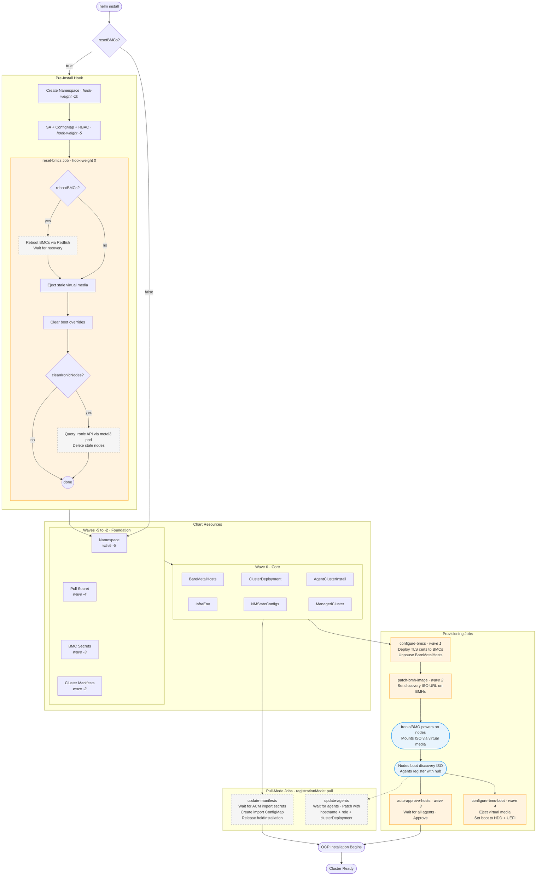

# Cluster Helm Chart

This Helm chart deploys an OpenShift cluster using the AgentClusterInstall method with baremetal hosts.

## Overview

This chart automates the deployment of:
- Namespace for cluster resources
- Pull secrets for container registries
- BMC (Baseboard Management Controller) credentials
- BareMetalHost definitions
- Network configuration via NMStateConfig
- ClusterDeployment and AgentClusterInstall resources
- InfraEnv for the installation environment

## Deployment Flow



**Legend**: Dashed-outline nodes are optional (controlled by values). Blue nodes are automated platform actions. Orange nodes are Ansible/shell Jobs.

| Value | Controls |
|-------|----------|
| `resetBMCs` | Enables the pre-install hook that resets BMCs before deployment |
| `rebootBMCs` | BMC reboot via Redfish Manager.Reset (requires `resetBMCs`) |
| `cleanIronicNodes` | Delete stale Ironic nodes from previous deployments (requires `resetBMCs`) |
| `deployCertsToBMCs` | Inject hub ingress CA + Ironic TLS certs into BMC truststores (wave 1) |
| `autoApproveHosts` | Auto-approve agents once all have registered (wave 3) |
| `registrationMode` | `"pull"` enables pull-mode Jobs for controlled ACM registration |

## Installation

```bash
helm install my-cluster ./provisioning/charts/cluster -f my-values.yaml
```

### ISO URL Display

The chart includes a **post-install hook** that waits for the InfraEnv ISO URL to be generated and displays it during installation. This means `helm install` will:

1. Create all cluster resources
2. Wait for the InfraEnv operator to generate the discovery ISO (usually 30-60 seconds)
3. Display the ISO download URL with ready-to-use wget and curl commands
4. Complete the installation

The hook will wait up to 10 minutes (configurable via `isoUrlFetcher.timeout`) for the ISO URL to be available. If you need to skip this wait, you can delete the hook Job after installation starts.

You can also view the ISO URL later using the NOTES output, which uses Helm's `lookup` function to check the InfraEnv status:
```bash
helm get notes my-cluster
```

## Configuration

The chart creates resources in the following order (Helm's default alphabetical ordering ensures dependencies are met):

1. **Namespace** - Created first to hold all other resources
2. **Secrets** - Pull secret and BMC credentials
3. **ConfigMap** - Cluster manifests containing MachineConfig objects
4. **Core Resources**:
   - AgentClusterInstall
   - BareMetalHost resources
   - ClusterDeployment
   - InfraEnv
   - NMStateConfig for network configuration

## Key Configuration Values

### Cluster Configuration
- `clusterName`: Name of the cluster
- `namespace`: Namespace where resources will be created
- `namespaceResourcePolicy`: Controls whether the namespace is deleted on helm uninstall
  - `"keep"` (default): Namespace is preserved - recommended to prevent accidental deletion of resources
  - `"delete"`: Namespace is removed with helm uninstall - use if you want full cleanup
- `baseDomain`: Base domain for the cluster
- `sshPublicKey`: SSH public key for cluster access
- `baremetalHostPaused`: Controls BareMetalHost automatic provisioning behavior
  - `"true"` (default): ACM will NOT automatically manage or provision hosts - recommended for manual control
  - `"false"`: ACM will automatically use BMC for provisioning and management - may cause unexpected reboots
- `baremetalHostResourcePolicy`: Controls whether BareMetalHost resources are deleted on helm uninstall
  - `"keep"` (default): BareMetalHost resources are preserved - recommended to prevent accidental host state deletion
  - `"delete"`: BareMetalHost resources are removed with helm uninstall - use if you want full cleanup
- `registrationMode`: Controls how the cluster registers back to ACM (Advanced Cluster Management)
  - `"push"` (default): ACM pushes registration manifests to the cluster (standard ACM behavior)
  - `"pull"`: Cluster pulls registration manifests from ACM in a controlled manner
    - Creates post-install Jobs that wait for ACM import secrets
    - Configures agents with node-specific settings
    - Provides more control over the registration process
    - Useful for environments with strict network policies or air-gapped scenarios

### Network Configuration
- `agentClusterInstall.apiVIP`: Virtual IP for API server
- `agentClusterInstall.ingressVIP`: Virtual IP for ingress
- `agentClusterInstall.networking`: Network CIDR configurations

### Node Configuration
Each node in the `nodes` array requires:
- `name`: Node identifier
- `bmcAddress`: Redfish/IPMI address for BMC
- `bmcCredentials`: Username and password for BMC access
- `bootMACAddress`: MAC address for PXE boot
- `hostname`: FQDN of the node
- `role`: Node role (typically "master")
- `rootDeviceWWN`: WWN of the root disk
- `network`: Network configuration (IP, gateway, DNS)

### Cluster Manifests

The `clusterManifests` section accepts a map of filename → YAML content pairs. Each entry becomes a file in the `cluster-manifests` ConfigMap that is applied during cluster installation.

Format:
```yaml
clusterManifests:
  <filename>.yaml: |
    <raw YAML manifest content>
```

You can include any Kubernetes/OpenShift manifests here, such as:
- MachineConfig objects for OS-level configuration
- Custom networking configurations
- Storage configurations
- Any other Day 0 manifests

Example:
```yaml
clusterManifests:
  99-master-kargs.yaml: |
    apiVersion: machineconfiguration.openshift.io/v1
    kind: MachineConfig
    metadata:
      labels:
        machineconfiguration.openshift.io/role: "master"
      name: 99-master-kargs
    spec:
      kernelArguments:
        - console=ttyS0,115200n8
```

To disable cluster manifests entirely, set `clusterManifests: {}` or remove the section

## Example Values

See `values.yaml` for a complete example configuration.

## Resource Management

By default, the chart preserves resources during helm uninstall to prevent accidental data loss. This behavior can be controlled via resource policy values:

### Namespace Resource Policy

- **`keep` (default)**: Namespace is preserved during uninstall, along with any resources in it
- **`delete`**: Namespace is removed during uninstall

To allow namespace deletion on uninstall:
```yaml
namespaceResourcePolicy: "delete"
```

### BareMetalHost Resource Policy

- **`keep` (default)**: BareMetalHost resources are preserved during uninstall, preventing accidental deletion of physical host state
- **`delete`**: BareMetalHost resources are removed during uninstall, allowing full cleanup

To allow BareMetalHost deletion on uninstall:
```yaml
baremetalHostResourcePolicy: "delete"
```

**Note**: If the namespace is preserved (`keep`), other resources in the namespace may also be preserved even if they don't have explicit resource policies.

## ACM Registration Modes

The chart supports two modes for registering the cluster back to Advanced Cluster Management (ACM):

### Push Mode (Default)

In **push mode** (`registrationMode: "push"`), ACM follows its standard behavior:
- ACM detects the cluster deployment
- ACM automatically pushes import manifests to the cluster
- Registration happens automatically

This is the standard ACM workflow and requires no additional configuration.

### Pull Mode

In **pull mode** (`registrationMode: "pull"`), the cluster pulls registration information from ACM in a more controlled manner:

1. **Post-install Jobs are created** that:
   - Wait for ACM to create import secrets
   - Extract and modify import manifests
   - Configure agents with node-specific settings
   - Patch the AgentClusterInstall to use custom import manifests

2. **Benefits of pull mode**:
   - More control over the registration timing and process
   - Useful for air-gapped or restricted network environments
   - Allows modification of import manifests before application
   - Configures agent-to-node mappings automatically

3. **How it works**:
   - A `node-configs` ConfigMap is created with hostname and role mappings for each node
   - The `update-manifests` Job waits for ACM import secrets, then creates a ConfigMap with modified import manifests
   - The `update-agents` Job watches for Agent resources to be created and patches them with node-specific configuration
   - The AgentClusterInstall is patched to **add** the import manifests ConfigMap to its existing `manifestsConfigMapRefs` array
   - **Important**: Pull-mode does NOT overwrite your existing cluster manifests - it appends the import manifests to the existing list

To enable pull mode:
```yaml
registrationMode: "pull"
```

**Note**: Pull mode creates additional post-install hook Jobs with higher hook weights (20-23) so they run after the ISO URL fetcher (weight 10).

## Customization

To customize for your environment:

1. Copy `values.yaml` to a new file (e.g., `my-values.yaml`)
2. Update cluster configuration:
   - Cluster name and domain
   - VIP addresses
   - SSH public key
   - Pull secret
3. Update node configurations:
   - BMC addresses and credentials
   - MAC addresses
   - IP addresses and network settings
   - Root device WWNs
4. Install with your custom values:
   ```bash
   helm install my-cluster ./provisioning/charts/cluster -f my-values.yaml
   ```

## Uninstallation

```bash
helm uninstall my-cluster
```

Note: BareMetalHost resources will be kept due to the resource policy annotation. Clean these up manually if needed.
